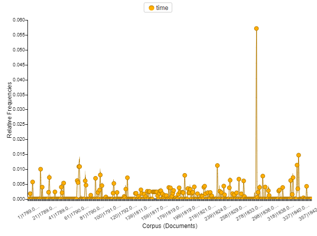
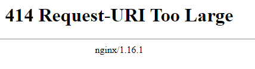

# Part 3 - Arguing
## Video to watch
[Argue Video](https://www.youtube.com/watch?v=92qYWZY4Xi0&t=1s&ab_channel=ShawnGraham)
+ Notes from video
It is no longer snowing while I'm watching this
white paper rcnn, help orient
digital humanities awards
popular projects from around the world
open software movement
sharing to see errors
remove frustration from errors
take a break also works - yep
if it doesn't come in 30 mins, it won't come in 3 hours
tie experience to readings
to try more and play with it

##DO
+ 1 Text Analysis = Voyant
I decided to pick this one since it looks more modern (user interface and seems probably more easy to navigate with buttons rather than text commands)
### May 26 start
**Video**
[text-analysis](https://www.youtube.com/watch?v=8MLV19M1WIM&ab_channel=ShawnGraham)
Caring about text Analysis
- collects texts
- looks for patterns
- finds relationships
- interprets the meanings
- makes the argument for wider significance
- Do it at large scale and replicable for new questions

[Voyant Hello](https://www.youtube.com/watch?v=3u-zDUvW3dQ&t=4s&ab_channel=sgsinclair)
gateway drug to digital history
*corpus id* = 7bf416b289d729b932e3252a439f42b7
choose the word time to see what's going on

so I tried choosing the link tool with words but...

I think it has to do with the fact that when I started playing with the amount of words/links, it kept adding more and more even though I was trying to reduce them (they were getting too jumbled and unreadable due to small size)
The website started blacking out which I was worried my pc was at fault but then it crashed when I attempted to request the j jumbled mess of a result.
I tried again but got the same results (unresponsive popup page and error)
Tried refreshing the main page and it was loading for a solid 5 mins which got me worried about crashing the website
here is my html snippet down below

<!--	Exported from Voyant Tools (voyant-tools.org).
The iframe src attribute below uses a relative protocol to better function with both
http and https sites, but if you're embedding this into a local web page (file protocol)
you should add an explicit protocol (https if you're using voyant-tools.org, otherwise
it depends on this server.
Feel free to change the height and width values or other styling below: -->
<iframe style='width: 637px; height: 507px;' src='https://voyant-tools.org/tool/Mandala/?query=new&query=country&query=mr&query=great&query=%C3%A4%C3%AC&query=time&query=land&query=states&query=state&query=government&corpus=7bf416b289d729b932e3252a439f42b7'></iframe>

Building my own corpus...
[webpage for files](https://guides.loc.gov/chronicling-america-fugitive-slave-ads/selected-articles)
Going further
Made a new directory to store files using w-get...
Realize there is a lot of coding involved and I'm arriving with a language barrier.
I see that on June 4th, the w-get is replaced by the APIs tutorial.. so I won't bother progressing with going further.
If I were, I assume it would just be the previous w-get file from week 2 tutorial with a little (a lot) more complex python script to selectively save particular info like html/links, date and titles into a .csv file to finally import into voyant... that way you could build a big dataset with relative ease...

+ 1 Digital Storytelling
Storymaps.js
This tool is really easy to use (user friendly). I just think that reading image metadata (location taken) is a missed opportunity for a storymap application like this. Many pics are taken with phones and uploaded, they can carry gps coordinates where pics were taken.
*This is the embed*
<iframe src="https://uploads.knightlab.com/storymapjs/98d1960e13fb9e904027f038a775be34/costa-rica/index.html" frameborder="0" width="100%" height="800"></iframe>

+ 1 Mapping
Maps from spreadsheets

https://www.google.com/maps/d/edit?mid=1Hd3m2gYJP3ur4xkdWtXa0kdinzNe8_PB&usp=sharing
*embed link to my map*
<iframe src="https://www.google.com/maps/d/embed?mid=1Hd3m2gYJP3ur4xkdWtXa0kdinzNe8_PB" width="640" height="480"></iframe>
